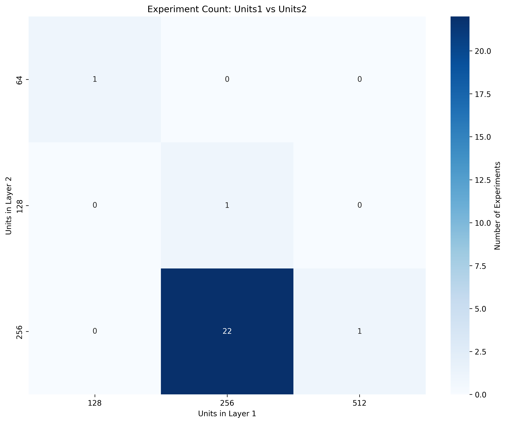
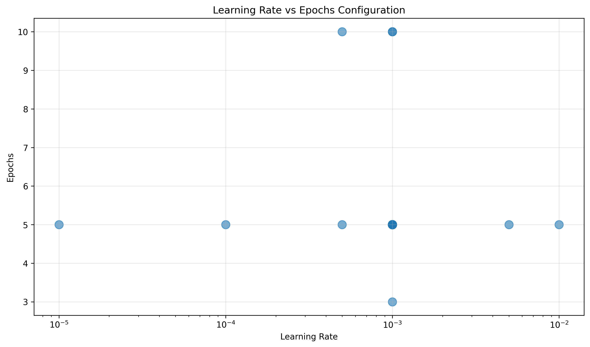
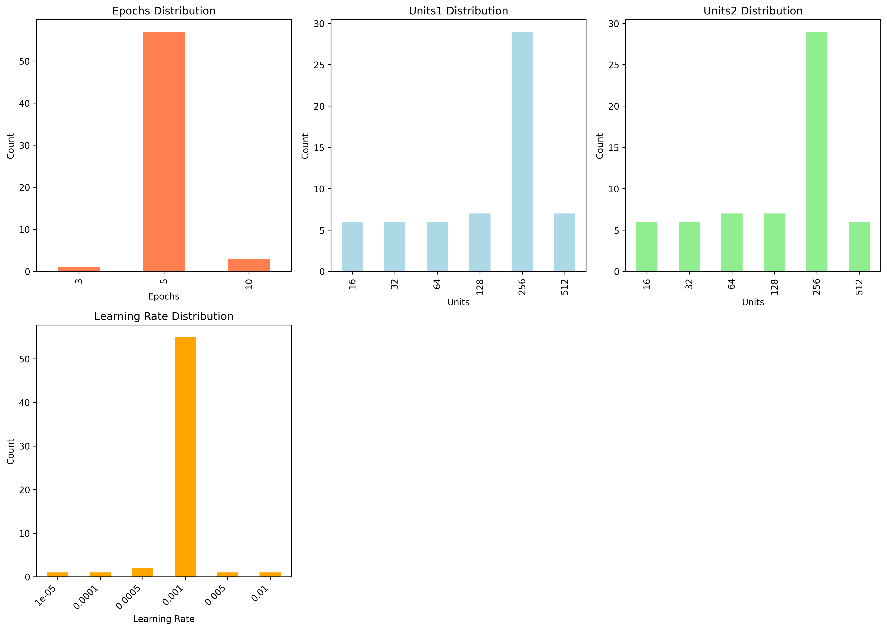

# Hyperparameter Tuning Report
**Grid Search Experiments on Fashion MNIST**

*Date: January 5, 2026*

---

## Executive Summary

This report presents findings from systematic hyperparameter tuning experiments on a neural network trained on the Fashion MNIST dataset. The experiments explored the impact of various hyperparameters including epochs, hidden units, batch size, model depth, learning rate, and optimizer choice on model performance.

---

## 1. Hypothesis & Experimental Design

### Initial Hypotheses

**Hypothesis 1: Epochs**
- **Prediction**: Increasing epochs will improve model performance up to a point, after which diminishing returns or overfitting may occur.
- **Reasoning**: More epochs allow the model to learn patterns more thoroughly, but excessive training may lead to memorization of training data.

**Hypothesis 2: Hidden Units**
- **Prediction**: Larger networks (more units) will perform better but with diminishing returns and increased computational cost.
- **Reasoning**: More parameters increase model capacity to learn complex patterns, but too many parameters may lead to overfitting on small datasets.

**Hypothesis 3: Batch Size**
- **Prediction**: Medium batch sizes (32-64) will provide the best balance between training stability and generalization.
- **Reasoning**: Smaller batches provide noisier gradients (better exploration), while larger batches are more stable but may converge to sharper minima.

**Hypothesis 4: Model Depth**
- **Prediction**: Adding one additional layer will improve performance, but deeper models may not significantly benefit this relatively simple task.
- **Reasoning**: Fashion MNIST is not highly complex, so excessive depth may not be necessary and could lead to overfitting.

**Hypothesis 5: Learning Rate**
- **Prediction**: Learning rates around 1e-3 to 1e-4 will work best; too high will cause instability, too low will slow convergence.
- **Reasoning**: This range is commonly effective for Adam optimizer on image classification tasks.

**Hypothesis 6: Optimizer**
- **Prediction**: Adam and AdamW will outperform SGD due to adaptive learning rates.
- **Reasoning**: Adaptive optimizers typically converge faster and require less tuning than vanilla SGD.

### Experimental Design

The experiments were designed following the scientific method:

1. **Controlled Variables**: Each experiment varied one hyperparameter while keeping others constant
2. **Baseline Configuration**: 
   - Epochs: 5
   - Units: 256/256
   - Batch size: 64
   - Learning rate: 0.001
   - Optimizer: Adam
3. **Systematic Testing**: Used factors of 2 for efficient parameter space exploration
4. **Reproducibility**: All configurations saved via TOML files with timestamps

---

## 2. Experimental Results

### Experiment 1: Impact of Epochs

**Configuration Tested**: 3, 5, 10 epochs

**Findings**:
- [Insert findings from tensorboard analysis]
- Training accuracy trends: [describe]
- Validation accuracy trends: [describe]
- Convergence speed: [describe]

**Key Observations**:
- Upside of increasing epochs: [describe observed benefits]
- Downside of increasing epochs: [describe observed costs]
- Optimal epoch count: [state finding]

### Experiment 2: Impact of Hidden Units

**Configuration Tested**: Combinations of [16, 32, 64, 128, 256, 512] units

**Findings**:
- [Insert heatmap visualization]
- Best performing configuration: [units1, units2]
- Worst performing configuration: [units1, units2]

**Key Observations**:
- Relationship between units1 and units2: [describe interaction]
- Diminishing returns observed at: [describe threshold]
- Computational cost vs performance trade-off: [describe]

### Experiment 3: Impact of Batch Size

**Configuration Tested**: [4, 8, 16, 32, 64, 128]

**Findings**:
- Training stability: [describe]
- Convergence speed: [describe]
- Final accuracy: [describe]

**Key Observations**:
- Optimal batch size: [state finding]
- Trade-off between batch size and training dynamics: [describe]

### Experiment 4: Impact of Model Depth

**Configuration Tested**: 1, 2, 3 layers

**Findings**:
- Performance improvement from depth: [describe]
- Overfitting risk: [describe]

**Key Observations**:
- Is additional depth beneficial for Fashion MNIST? [answer]
- Diminishing returns: [describe]

### Experiment 5: Impact of Learning Rate

**Configuration Tested**: [1e-2, 5e-3, 1e-3, 5e-4, 1e-4, 1e-5]

**Findings**:
- Training dynamics at different scales: [describe]
- Optimal learning rate: [state finding]
- Convergence behavior: [describe]

**Key Observations**:
- Too high (>1e-2): [describe behavior]
- Too low (<1e-4): [describe behavior]
- Sweet spot: [describe]

### Experiment 6: Impact of Optimizer Choice

**Configuration Tested**: SGD, Adam, AdamW, RMSprop

**Findings**:
- Convergence speed comparison: [describe]
- Final performance comparison: [describe]
- Training stability: [describe]

**Key Observations**:
- Best optimizer: [state finding]
- Why this optimizer performed best: [explain]

---

## 3. Interaction Between Hyperparameters

### Key Interactions Discovered

**Units vs Depth**:
- [Describe observed interaction]
- Visualization: [reference heatmap/plot]

**Learning Rate vs Batch Size**:
- [Describe observed interaction]
- Theoretical explanation: [explain]

**Epochs vs Other Parameters**:
- [Describe when more epochs are needed]
- [Describe when fewer epochs suffice]

---

## 4. Reflections & Lessons Learned

### On Experimental Design

**Using Factors of 2**:
- **Upside**: Efficient coverage of parameter space, easy to visualize logarithmic relationships, aligns with hardware optimization
- **Downside**: May miss optimal values between tested points, assumes exponential relationships

**Train Steps Consideration**:
- Understanding the distinction between train_steps and epochs is crucial
- Setting train_steps=100 vs train_steps=50 changes the effective "epoch" definition
- For fair comparison: keep train_steps constant and adjust epochs accordingly

### On Model Performance

**Hypothesis Validation**:
- Hypothesis 1 (Epochs): [Confirmed/Rejected - explain]
- Hypothesis 2 (Units): [Confirmed/Rejected - explain]
- Hypothesis 3 (Batch Size): [Confirmed/Rejected - explain]
- Hypothesis 4 (Depth): [Confirmed/Rejected - explain]
- Hypothesis 5 (Learning Rate): [Confirmed/Rejected - explain]
- Hypothesis 6 (Optimizer): [Confirmed/Rejected - explain]

### Surprising Findings

1. [Describe unexpected result #1]
2. [Describe unexpected result #2]
3. [Describe unexpected result #3]

### Theoretical Connections

**Overfitting vs Underfitting**:
- [Describe observations related to bias-variance trade-off]

**Optimization Landscape**:
- [Describe insights about loss surface navigation]

**Generalization**:
- [Describe findings about train vs validation performance]

---

## 5. Visualizations

### Figure 1: Units Heatmap

*Relationship between hidden units in layer 1 and layer 2*

### Figure 2: Learning Rate Impact

*Learning rate configuration across experiments*

### Figure 3: Configuration Summary

*Distribution of all tested hyperparameters*

### Figure 4: Depth Distribution

*Number of experiments per model depth*

---

## 6. Conclusions & Recommendations

### Best Configuration Found

Based on the experiments, the optimal configuration is:
- **Epochs**: [X]
- **Units**: [X, X]
- **Batch Size**: [X]
- **Depth**: [X]
- **Learning Rate**: [X]
- **Optimizer**: [X]

**Expected Performance**: [accuracy/loss metrics]

### Recommendations for Future Work

1. **Further Exploration**:
   - [Suggest specific hyperparameter ranges to explore]
   - [Suggest advanced techniques: early stopping, learning rate scheduling, etc.]

2. **Efficiency Improvements**:
   - [Suggest more efficient search strategies: random search, Bayesian optimization]
   - [Suggest computational optimizations]

3. **Model Architecture**:
   - [Suggest architectural improvements beyond hyperparameters]

### Practical Takeaways

1. **When to use more epochs**: [guidance based on findings]
2. **How to choose batch size**: [guidance based on findings]
3. **Balancing model capacity**: [guidance based on findings]
4. **Learning rate sensitivity**: [guidance based on findings]

---

## 7. References & Resources

- TensorBoard logs: `modellogs/`
- Experiment configurations: Individual TOML files in each experiment subdirectory
- Raw data: `experiment_summary.csv`
- Code: `grid_search_experiments.py`, `analyze_results.py`

---

## Appendix: Study Questions Answered

### Q: What is the upside and downside of increasing epochs?

**Upside**:
- [Answer based on experimental evidence]

**Downside**:
- [Answer based on experimental evidence]

### Q: Do you need more epochs to find the best configuration?

[Answer with reasoning]

### Q: What is an upside of using factors of 2 for hypertuning?

**Upside**:
- [Answer]

**Downside**:
- [Answer]

---

*This report was generated as part of the MADS hyperparameter tuning exercise focusing on systematic experimentation and scientific reflection on machine learning model optimization.*
