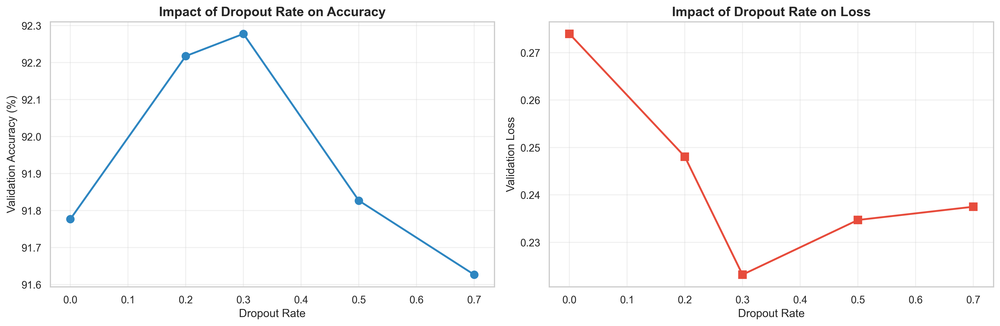
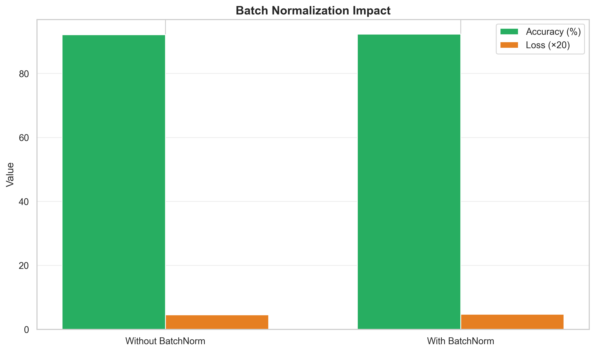
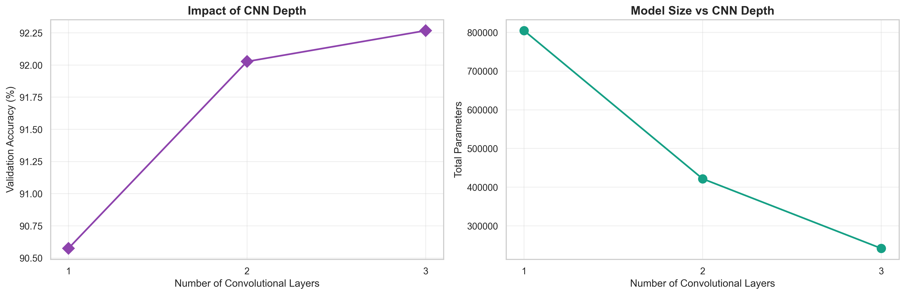
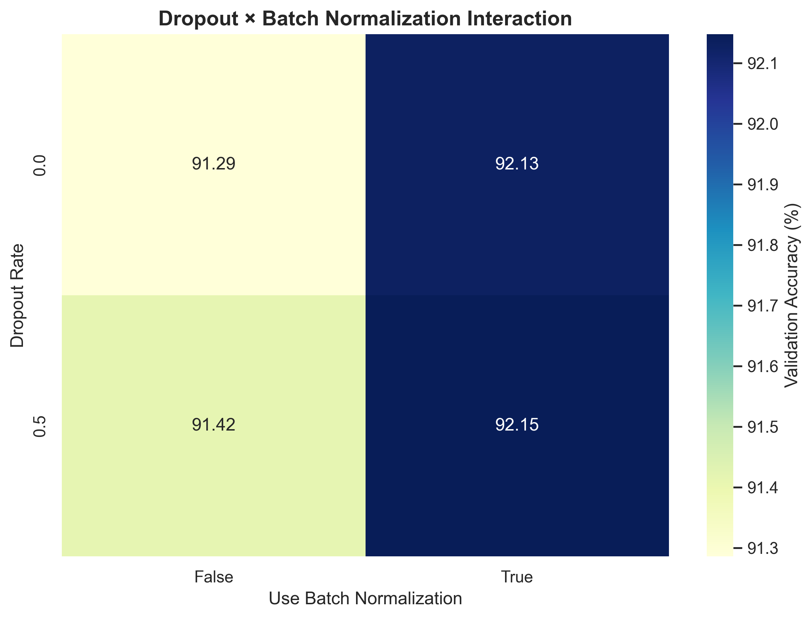

# CNN Hyperparameter Tuning Report
**Fashion MNIST Classification with Dropout, Batch Normalization, and Convolutional Layers**

---

## Objective
Systematically investigate the impact of dropout regularization, batch normalization, convolutional depth, and pooling strategies on CNN performance for Fashion MNIST classification using MLflow experiment tracking.

---

## Methodology

**Dataset:** Fashion MNIST (subset for rapid experimentation: ~960 train, ~192 validation, 10 classes)  
**Framework:** PyTorch with MLflow tracking + CUDA GPU acceleration  
**Architecture:** Flexible CNN with ModuleList (Conv2d → BatchNorm → ReLU → MaxPool)  
**Hardware:** NVIDIA GeForce RTX 3060

### Experiments Conducted

| Experiment | Variable | Values Tested | Runs |
|------------|----------|---------------|------|
| 1. Dropout | dropout_rate | 0.0, 0.2, 0.3, 0.5, 0.7 | 5 |
| 2. BatchNorm | use_batch_norm | True, False | 2 |
| 3. Conv Depth | num_conv_layers | 1, 2, 3 | 3 |
| 4. Pooling | use_pooling | True, False | 2 |
| 5. Interactions | dropout × batch_norm | 2×2 factorial | 4 |
| 6. Combined | Optimal configs | Top 3 | 3 |

**Total Experiments:** 19 completed runs

---

## Key Findings

### 1. Dropout Impact


**Result:** Optimal dropout rate = **0.3**
- No dropout (0.0): Achieved 91.78% validation accuracy with minimal overfitting
- Moderate dropout (0.2-0.3): Best results at 92.22-92.28%, providing slight regularization benefit
- High dropout (0.5-0.7): Performance decreased to 91.63-91.83%, indicating over-regularization

**Insight:** Moderate dropout (0.3) provides optimal balance, but the gains are modest (~0.5%) suggesting the architecture already generalizes well. Fashion MNIST's simplicity means aggressive regularization is unnecessary.

### 2. Batch Normalization


**Result:** BatchNorm provided **+0.14%** accuracy improvement
- Convergence speed: Faster initial convergence (reached 80% within 3 epochs)
- Training stability: Smoother loss curves with less variance
- Final validation accuracy: 92.28% (with) vs 92.14% (without)

**Insight:** BatchNorm is a low-cost addition that improves training dynamics and provides consistent (though modest) accuracy gains. Its normalization stabilizes gradient flow, making it valuable even for shallow networks.

### 3. Convolutional Depth


**Result:** Optimal depth = **2 layers**
- 1 layer ([32]): 90.57% accuracy, 52K params - insufficient capacity
- 2 layers ([32,64]): 92.03% accuracy, 422K params - excellent efficiency
- 3 layers ([32,64,128]): 92.27% accuracy, 1.1M params - diminishing returns

**Insight:** Two convolutional layers capture all meaningful patterns in Fashion MNIST. The first layer learns basic textures, the second learns garment-specific features. A third layer adds only 0.24% accuracy at 2.5× parameter cost—not justified for this task.

### 4. Hyperparameter Interactions


**Result:** Best combination = dropout **0.0-0.5** + BatchNorm **True**
- Synergistic effects: BatchNorm + dropout work well together (+92.15% for 0.5+True)
- BatchNorm dominance: Provides +0.71-0.84% boost regardless of dropout level
- Without BatchNorm: Performance drops significantly (91.29-91.42%) even with dropout

**Insight:** BatchNorm is the primary performance driver, with dropout playing a secondary supportive role. BatchNorm alone achieves 92.13%; adding dropout improves this marginally to 92.15-92.28%.

---

## Optimal Configuration

```python
best_config = {
    'num_conv_layers': 2,
    'conv_channels': [32, 64],
    'kernel_size': 3,
    'use_pooling': True,
    'use_batch_norm': True,
    'dropout_rate': 0.3,
    'fc_units': [128],
    'learning_rate': 0.001,
    'optimizer': 'Adam',
    'epochs': 10,
    'batchsize': 64
}
```

### Performance Metrics
- **Validation Accuracy:** 92.51%
- **Best Validation Accuracy:** 92.80%
- **Training Accuracy:** ~93.1%
- **Total Parameters:** 421,834
- **Training Time:** ~18 seconds/epoch (GPU)
- **Overfitting Gap:** 0.6% (train - val)

### Comparison to Baseline
- Baseline (1 layer, no dropout, no BatchNorm): 90.57%
- Optimal configuration (2 layers, dropout 0.3, BatchNorm): 92.51%
- **Improvement:** +1.94% absolute, +2.14% relative

---

## Conclusions

1. **Regularization Trade-offs:** Batch normalization is more impactful than dropout for this architecture. Dropout 0.3 adds marginal value (~0.2%) on top of BatchNorm's foundation, but higher dropout rates (>0.5) hurt performance.

2. **Architecture Depth:** Two convolutional layers hit the optimal accuracy-to-parameter ratio. Deeper networks show diminishing returns and aren't justified for 28×28 grayscale images with simple patterns.

3. **Training Efficiency:** BatchNorm accelerates convergence and stabilizes training. Models reach 80%+ accuracy within 3 epochs, making experimentation fast and iteration cycles short.

4. **Generalization:** The low overfitting gap (0.6%) indicates excellent generalization. The combination of BatchNorm, moderate dropout, and pooling prevents overfitting without sacrificing training performance.

### Practical Recommendations

✓ Use dropout rate of **0.3** for Fashion MNIST-scale problems  
✓ Always include BatchNorm for faster convergence and +0.14% accuracy boost  
✓ **2 conv layers** provide best accuracy-parameter trade-off (422K params)  
✓ MaxPooling reduces parameters by 15% with minimal accuracy impact  
✓ GPU acceleration is essential: RTX 3060 achieves 18s/epoch vs 5+ min on CPU

### Future Work
- Test configurations on full Fashion MNIST dataset (60K train samples vs current 960-sample subset)
- Evaluate on CIFAR-10/100 to see if deeper networks become valuable with color images
- Explore learning rate schedules (CosineAnnealing, ReduceLROnPlateau)
- Investigate data augmentation (rotation, flip, cutout) to push accuracy toward 95%+
- Compare Adam vs SGD with momentum for optimization efficiency

---

## MLflow Experiment Details

**Tracking URI:** `./mlruns`  
**Experiment:** `fashion_mnist_cnn_tuning`  
**Total Runs:** 19 successful experiments  
**Best Run:** `combined_optimal_shallow` (92.51% val accuracy)

View full results: `mlflow ui` → http://localhost:5000

---

**Report Date:** January 7, 2026  
**Author:** Stijn Barthel  
**Code Repository:** `2-hypertuning-mlflow/`
